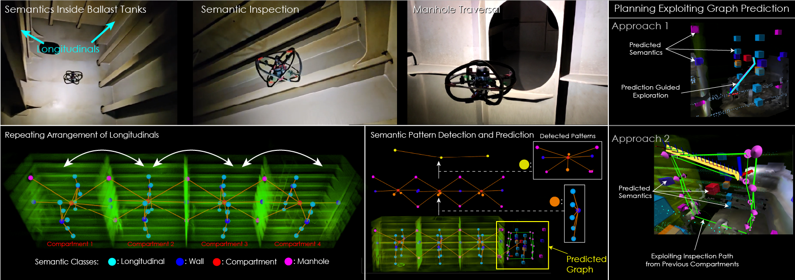

This repository contains the code for the Semaitcs-aware Predictive Inspection Planner.

This work presents a novel semantics-aware inspection path planning paradigm called “Semantics-aware Predictive Planning” (SPP). Industrial environments that require the inspection of specific objects or structures (called “semantics”), such as ballast water tanks inside ships, often present structured and repetitive spatial arrangements of the semantics of interest. Motivated by this, we first contribute an algorithm that identifies spatially repeating patterns of semantics - exact or inexact - in a semantic scene graph representation and makes predictions about the evolution of the graph in the unseen parts of the environment using these patterns. Furthermore, two inspection path planning strategies, tailored to ballast water tank inspection, that exploit these predictions are proposed. To assess the performance of the novel predictive planning paradigm, both simulation and experimental evaluations are performed. First, we conduct a simulation study comparing the method against relevant state-of-the-art techniques and further present tests showing its ability to handle imperfect patterns. Second, we deploy our method onboard a collision-tolerant aerial robot operating inside the ballast tanks of two real ships. The results, both in simulation and field experiments, demonstrate significant improvement over the state-of-the-art in terms of inspection time while maintaining equal or better semantic surface coverage.

### Code release date: May 7th 2025