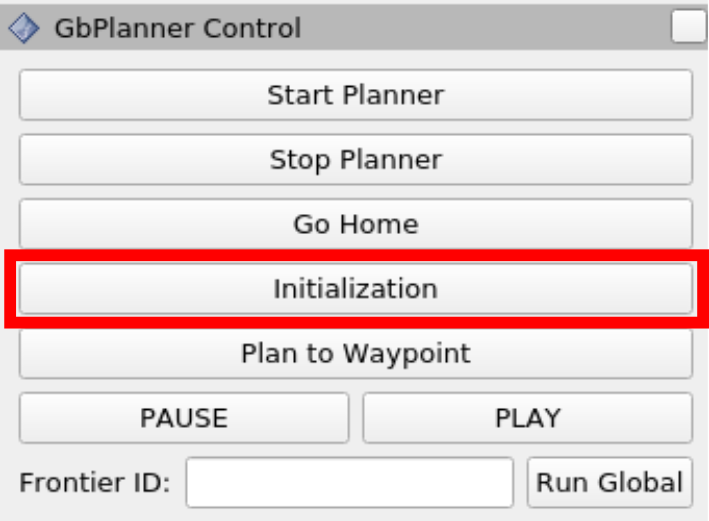
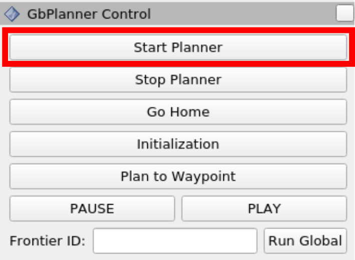

## Semantics-aware Predictive Inspection Path Planning

This repository contains the code for the Semaitcs-aware Predictive Inspection Planner.


This work presents a novel semantics-aware inspection path planning paradigm called “Semantics-aware Predictive Planning” (SPP). Industrial environments that require the inspection of specific objects or structures (called “semantics”), such as ballast water tanks inside ships, often present structured and repetitive spatial arrangements of the semantics of interest. Motivated by this, we first contribute an algorithm that identifies spatially repeating patterns of semantics - exact or inexact - in a semantic scene graph representation and makes predictions about the evolution of the graph in the unseen parts of the environment using these patterns. Furthermore, two inspection path planning strategies, tailored to ballast water tank inspection, that exploit these predictions are proposed. To assess the performance of the novel predictive planning paradigm, both simulation and experimental evaluations are performed. First, we conduct a simulation study comparing the method against relevant state-of-the-art techniques and further present tests showing its ability to handle imperfect patterns. Second, we deploy our method onboard a collision-tolerant aerial robot operating inside the ballast tanks of two real ships. The results, both in simulation and field experiments, demonstrate significant improvement over the state-of-the-art in terms of inspection time while maintaining equal or better semantic surface coverage.


## Installation

### Create a workspace for predictive planning
```bash
mkdir -p ~/predictive_planning_ws/src/planning
```

### Install tools and dependancies:
```bash
sudo apt install python3-pip lsb-release gnupg curl git
pip3 install vcstool
sudo apt install python3-catkin-tools \
libgoogle-glog-dev \
ros-noetic-joy \
ros-noetic-twist-mux \
ros-noetic-interactive-marker-twist-server \
ros-noetic-octomap-msgs \
ros-noetic-octomap-ros \
git-lfs \
libgsl-dev
```

### Clone the planner and packages
```bash
cd ~/predictive_planning_ws/src/planning
git clone git@github.com:ntnu-arl/predictive_planning_ros.git
cd ~/predictive_planning_ws
vcs import < ./src/planning/predictive_planning_ros/vcstool/packages.repos
cd src/sim/subt_cave_sim
git lfs pull
```

### Build
```bash
cd ~/predictive_planning_ws
catkin config -DCMAKE_BUILD_TYPE=Release
catkin build
source devel/setup.bash
```

## Running the Demo
We provide a demo inside a ballast tank environment for the Opportunistic Inspection and Assisted Exploration submodes along with the Baseline solution that does not use predictive planning.

The instructions below explain how to run the demos:

### Source the workspace
```bash
cd ~/predictive_planning_ws
source devel/setup.bash
```

### Run one of the three launch files:

#### Opportunistic Inspection:
```bash
roslaunch predictive_planning bwt1_oi.launch
```

#### Assisted Exploration:
```bash
roslaunch predictive_planning bwt1_ae.launch
```

#### Baseline:
```bash
roslaunch predictive_planning bwt1_baseline.launch
```

### Starting the mission

#### 1. Initialization motion
At the beginning of the mission the robot needs to move to update the volumetric map and clear the space around it. To fascilitate this, an initialization behavior is provided. The robot follows a specific path defined in the `config/bwt1/<planner_mode>/planner_control_interface_sim_config.yaml`.  
After launching the stack, click on the ```Initialization``` button in the UI to perform initialization motion.  



#### 2. Starting the planner
Click the ```Start Planner``` button once initialization is completed.  


The robot will complete the mission and return to the starting point.

## Acknowledgements
This open-source release is based upon work supported by a) the **Research Council of Norway project SENTIENT** (Project No. 321435), and b) the **European Commission** through **Project AUTOASSESS** under the **Horizon Europe Grant*** (Grant number 101120732).


You can contact us for any question:
* [Mihir Dharmadhikari](mailto:mihir.dharmadhikari@ntnu.no)
* [Kostas Alexis](mailto:konstantinos.alexis@ntnu.no)
